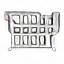

# Checkout Challenge

Welcome to the Checkout Challenge, a high-speed racing game developed in CircuitPython for the Adafruit PyBadge. In this game, you can race different types of trolleys, upgrade them, and compete to win prizes. This README will guide you through the setup, controls, and gameplay mechanics. Inspired by popular racing video games, this game puts a fun twist on everyday shopping by turning it into a thrilling racing experience.

You can see a full write-up here at my Hackster page: [Checkout Challenge](https://www.hackster.io/314reactor/checkout-challenge-4d60a3) 
and my Electromaker page: [Checkout Challenge](https://www.electromaker.io/profile/314Reactor)

## Table of Contents
- [Features](#features)
- [Setup](#setup)
- [Controls](#controls)
- [Gameplay](#gameplay)
  - [Main Menu](#main-menu)
  - [Trolleys](#trolleys)
  - [Upgrades](#upgrades)
  - [Obstacles](#obstacles)
  - [Difficulty Levels](#difficulty-levels)
  - [Race Mechanics](#race-mechanics)
- [LED Indicators](#led-indicators)
- [Graphics](#graphics)
- [Future Updates](#future-updates)
- [License](#license)

## Features
- Multiple difficulty levels
- Various types of trolleys with unique stats
- Upgradable parts to enhance trolley performance
- Randomly generated tracks with obstacles
- AI opponents

## Setup
1. **Download the Game Files**:
   - You will need an [Adafruit PyBadge](https://www.adafruit.com/product/4200) to play this game.
   - Download the latest release from the [releases page](https://github.com/LordofBone/CheckoutChallengePyBadge/releases) as a .zip file.

2. **Transfer Files to PyBadge**:
   - Connect your PyBadge to your computer via USB.
   - Drag and drop all the files and folders from the `CheckoutChallenge` .zip onto the root of the CIRCUITPY drive.

3. **Install CircuitPython Libraries**:
   - Ensure you have CircuitPython installed on your PyBadge. Follow the [CircuitPython installation guide](https://learn.adafruit.com/welcome-to-circuitpython/installing-circuitpython).
   - Install CircuitPython libraries on your PyBadge. Follow the [CircuitPython library installation guide](https://learn.adafruit.com/welcome-to-circuitpython/circuitpython-libraries), ensuring you install version 9.0.5 with the libraries from `requirements.txt` into the `lib` folder on your PyBadge.

4. **Restart the PyBadge**:
   - Eject the CIRCUITPY drive safely and reset the PyBadge if it doesn't restart automatically.
   - The game should now launch with the intro screen and theme music.

## Controls
- **D-Pad**: Move the trolley
- **A Button**: Boost
- **B Button**: Brake
- **Start Button**: Pause/Resume
- **Select Button**: Exit to menu

## Gameplay

### Main Menu
The main menu allows you to select a track, buy trolleys, select trolleys from your garage, and buy upgrades. You start off with $500 in-game currency to purchase your first trolley.

### Trolleys
There are four types of trolleys available, each with unique stats:

1. **CartMaster 1000** by **BudgetMart**: A standard trolley for everyday shopping needs. Costs $100 and has basic movement but can be upgraded to become quite fast and maneuverable. It has a max health of 120, weight of 36, speed of 1.8, acceleration of 0.5, deceleration of 0.35, grip of 0.2, boost strength of 1.5, and brake strength of 1.4.

2. **Speedy Shopper** by **QuickCart Co.**: A lightweight and fast trolley for the quick shopper. Costs $5000 and is faster than the CartMaster 1000 with better handling. It has a max health of 80, weight of 28, speed of 2.4, acceleration of 0.7, deceleration of 0.5, grip of 0.38, boost strength of 1.8, and brake strength of 1.6.

3. **Mega Mover** by **BulkBuy**: A heavy and durable trolley for those big shopping sprees. Costs $10000 and is heavier than the other trolleys but has a high amount of health, especially when upgraded. It is much more difficult to handle but can tank damage from obstacles. It has a max health of 300, weight of 80, speed of 2.04, acceleration of 0.8, deceleration of 0.4, grip of 0.3, boost strength of 1.2, and brake strength of 1.7.

4. **Turbo Trolley** by **HyperMart**: A high-performance trolley with superior speed and acceleration. Costs $20000 and is the fastest trolley in the game. It has the best acceleration and speed but is difficult to control due to its lower grip; if you can fully upgrade this, get ready for some insane speeds. It has a max health of 250, weight of 30, speed of 2.52, acceleration of 1.0, deceleration of 0.5, grip of 0.18, boost strength of 2.4, and brake strength of 2.2.

### Upgrades
You can purchase and install various upgrades to improve your trolley's performance:

- **Carbon Fibre Wheels**: Increases speed by 0.05, grip by 0.2, and brake strength by 0.4. Costs $700.

- **Racing Handle**: Increases speed by 0.075 and grip by 0.22. Costs $1000.

- **Scanning Computer**: Increases speed by 0.025 and acceleration by 0.05. Costs $2000.

- **Carbon Fibre Frame**: Increases speed by 0.04, acceleration by 0.075, and max health by 120. Reduces weight by 12. Costs $5000.

- **Nitrous Oxide**: Increases speed by 0.06, acceleration by 0.3, and boost strength by 0.2. Decreases deceleration by 0.45. Costs $6000.

- **Brake Upgrade**: Increases deceleration by 0.25 and brake strength by 0.35. Costs $500.

- **Exhaust Upgrade**: Increases speed by 0.02, acceleration by 0.25, and boost strength by 0.12. Costs $800.

- **Turbo Upgrade**: Increases speed by 0.025, acceleration by 0.2, and boost strength by 0.15. Decreases deceleration by 0.5. Costs $4500.

- **Air Filter Upgrade**: Increases speed by 0.01, acceleration by 0.015, and boost strength by 0.02. Costs $350.

- **Computer Chip Upgrade**: Increases speed by 0.02, acceleration by 0.025, and boost strength by 0.15. Costs $2500.

- **Suspension Upgrade**: Increases grip by 0.15, deceleration by 0.085, and brake strength by 0.5. Costs $700.

### Obstacles
Various obstacles can appear on the track, each affecting the trolley differently:

- **Blocks**: Various sizes that obstruct the path, including checkout counters, DVD shelves, freezers, fridges, and walls.

- **People**: Less common than the above obstacles, but still avoid them to prevent slowing down.

- **Water Spills**: Reduces grip for a couple of seconds, making it harder to control the trolley.

- **Money**: Collect to earn in-game currency (a random amount between $10 and $1000).

### Difficulty Levels
Choose your difficulty level:

1. **Bargain Hunt**: For the casual shopper who loves a good deal. Lasts 1 minute, has a max of 5 obstacles, and awards $1500.
2. **Everyday Shopper**: For the regular shopper facing daily challenges. Lasts 2 minutes, has a max of 8 obstacles, and awards $4000.
3. **Black Friday Frenzy**: For the hardcore shopper braving the busiest sales. Lasts 3 minutes, has a max of 12 obstacles, and awards $9000.
4. **Clearance Chaos**: For the ultimate shopper surviving the wildest sales. Lasts 5 minutes, has a max of 18 obstacles, and awards $20000.

### Race Mechanics

#### Obstacles
- As you go through the track, you will encounter various obstacles that can slow you down and damage your trolley.
- The maximum number of obstacles spawned is defined by the difficulty level.
- Avoid these obstacles to maintain your speed and health. Bumping into them will cause you to bounce back and lose health.
- If your health reaches 0, your trolley will be destroyed, costing $250 to repair.

#### Collecting Money
- Collect money on the track to earn in-game currency.
- Use this currency to purchase upgrades and new trolleys.

#### AI Trolley Competition
- Each track features an AI-controlled trolley:
  - **Bargain Hunt**: CartMaster 1000
  - **Everyday Shopper**: Speedy Shopper
  - **Black Friday Frenzy**: Mega Mover
  - **Clearance Chaos**: Turbo Trolley
- The AI trolley will try to get ahead of you. If you manage to beat it by finishing ahead when the race ends, you will win the money.
- If you fall behind, you will lose. In the rare event you match it on the Y-axis when the race ends, you will draw and split the winnings.

## LED Indicators
The Adafruit PyBadge features 5 LEDs that provide visual feedback on your race progress:

- **Green LEDs**: The first three LEDs light up green from left to right, indicating the progress of the race.
- **Red LEDs**: The final two LEDs light up red.
  - **Second Last Red LED**: Lights up when the race is coming to an end, giving you a heads-up to make a final push.
  - **Final Red LED**: Stays lit during the last 10 seconds of the race to help you time your final manoeuvres.

This LED system helps you keep track of how much time is left, giving you an idea of when to push forward to get ahead of the AI trolley.

## Graphics
The sprite sheet is made by me using a sprite pixel editor, while the backgrounds are all generated using DALL-E 3. The sprites have shadows dynamically generated when they are loaded into the game, adding more depth to the visuals.

## Future Updates
- I will likely move this to work on normal Python and Pygame, as the PyBadge is somewhat limited in terms of performance. This would also allow the game to run on any computer.
- I plan to add more trolleys and upgrades, as well as more obstacles and tracks.
- I will include per-pixel effects such as smoke and sparks when the trolley is damaged, as well as a general shine effect to menus and the trolleys. (The PyBadge doesn't have enough memory or CPU to do this currently).

## Contributing
Feel free to fork this repository, create a branch, and submit a pull request. We appreciate your contributions!

## License
This project is licensed under the GNU GENERAL PUBLIC LICENSE. See the [LICENSE](LICENSE) file for details.
